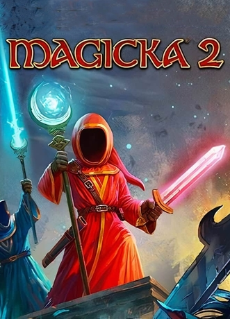

This game design document will go over every core mechanics of <ins>Twin Souls</ins>.

## What's Twin Souls ?

### Genre

* Two players cooperation game
* 3D environement
* Top-down isometric view
* Role play game (RPG) following multiple stages over a story
* Each stages will be composed of:
    * Puzzles to solve
    * Enemy waves to beat down
    * A boss fight

### Prototype scope

The prototype **WILL** be implementing the core mechanics of <ins>Twin Souls</ins>, but will be restrained to a single stage.  
The stage will showcase what's possible to use in a very simple level structure.  
The prototype **WILL NOT** implement any boss fight or story telling, as its main purpose is to test the core mechanics.  

Please refer to the [Prototype section](<../prototype/index.md>) for more informations.

### Quick description

In <ins>Twin Souls</ins>, each player incarnates a Twin.  
Twins are wizzards, in a fantasy world were magic is everything.  
What makes the Twins special is that they have a magical bond with each other, allowing them to mix their magic together.  
Twins can dynamically switch of elements while resolving puzzles or in the middle of fighting monsters.  
Mixing their elements can be done in a clever way, making the Twins more efficient during fights. 
But if done hastly, the result can become harmfull (getting lethal) for the Twins.  
Since Twins are sharing a special bond, one cannot live without the other. If a Twin dies, the other will follow its sibling.  

<ins>Twin Souls</ins> is a cooperation game, where communication is the key to success.

### Inspiration

Magicka 2 is the main source of inspiration for <ins>Twin Souls</ins>.  
Magicka 2 offers a very complex combat mechanic based on spell creation. 
Players have to combine up to 5 different elements together in order to cast a spell.  
The spell possibilities are so complex and countless, that the player most likely understands and masters the spell system only when reaching the end of the game.

## Documentation structure

This document is to be presented to each member of the developement team as a reference point for <ins>Twin Souls</ins>.  
The Github repository hosting the source code of the project and game design document can be retrieved 
[**here**](https://github.com/Mathieu-Schmerber/TwinSouls_prototype).

* Core Mechanics: [Gameplay](<index.md>)
    * Core mechanic: [Main Mechanic](<main-mechanic/Link-concept.md>)
    * Core mechanic: [Combat Mechanic](<combat-mechanic/weapons.md>)
    * Technical overview: [Pre production](<pre-production/technical.md>)
* Prototype explanations: [Prototype](<../prototype/index.md>)
* Reflection and play testing sessions: [Play testing](<../playtesting/index.md>)