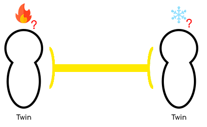

## Vote system

As mentioned earlier, [Twins](<../Twin.md>) can dynamically switch between elements during the game. 
However a [Twin](<../Twin.md>) cannot switch of element without consent of the other one, Twin Souls is a cooperation game after all !

When a [Twin](<../Twin.md>) wants to switch of element, 
he needs to emit a vote on an element he picked from the [🎡 Elements equality wheel](<Elements-equality-wheel.md>). 
The [Twin](<../Twin.md>) can change his vote after emitting it.

Whenever the other [Twin](<../Twin.md>) emits a vote to switch to another element, the switch is applied confirming the vote.

> 💡 **Example**
>
> The first [Twin](<../Twin.md>) votes for the fire element. Whenever the other [Twin](<../Twin.md>) wants, he votes for the lighting element. The votes get submitted, the first [Twin](<../Twin.md>) changes to fire while the other [Twin](<../Twin.md>) changes to lightning

## Link input

After the vote ends, the [Twins](<../Twin.md>) will start inputting their elements in the link.   
The elements take **{5 seconds}** to reach their destinations in the link, before resulting in any combination state.

⚠️ Values are to be set/changed after iterating playtest sessions.   Please refer to the [Play testing section](<../../playtesting/index.md>)

## Vote system sketching

> Sketch of the [Twins](<../Twin.md>) voting for their next elements (🔥 and ❄️).