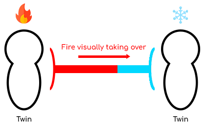

[Twins](<../Twin.md>) are linked together with a magical bond. The link is unmaterial, meaning it is not possible to collide with it. It extends and retracts indefinitely depending on the [Twins](<../Twin.md>) positions.

Each [Twin](<../Twin.md>) can input a magical element into the link, causing element combinations. The magical element a [Twin](<../Twin.md>) is inputting can be selected from the [🎡 Elements equality wheel](<Elements-equality-wheel.md>).

Combination outcomes can affect the link, leading to three different possible state:

* 🚫 Cancellation 

  → Both elements constantly collides at the very center of the link

  → [Twins](<../Twin.md>) can act freely

* 🔪 Repression

  → One of the two elements takes over the other, reaching the other [Twin](<../Twin.md>)

  → The repressed [Twin](<../Twin.md>) is now constantly affected by the other one

  → The repressed [Twin](<../Twin.md>) is harmed, can get lethal

  → The repressing [Twin](<../Twin.md>) can act freely

* 🌟 Fusion 

  → Both elements are complementary and reach both [Twins](<../Twin.md>)s

  → Each [Twin](<../Twin.md>) is now constantly enhanced by the other [Twin](<../Twin.md>)'s element 

**Quick sketching**:

> Representation of the link between the [Twins](<../Twin.md>)