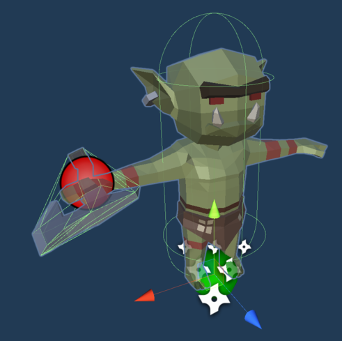
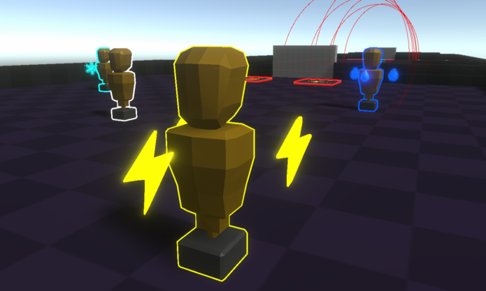
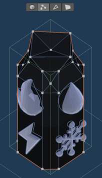
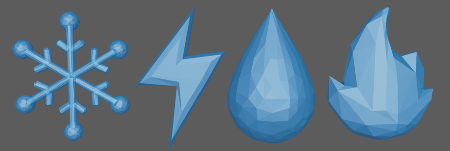
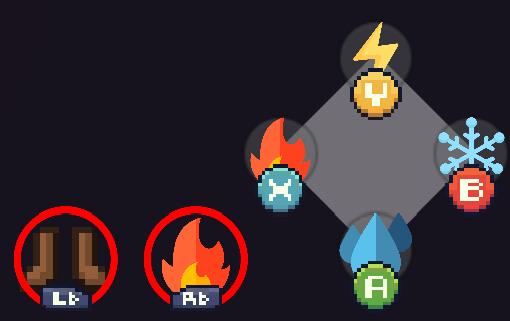

## Characters & Props

Since Twin Souls is a low poly game, the prototype is using the [POLYGON MINI - Fantasy Character Pack](https://assetstore.unity.com/packages/3d/characters/humanoids/fantasy/polygon-mini-fantasy-character-pack-122084) asset pack.
Every character like the Twins or the enemies come from this asset pack.  
Weapons that the characters are holding also come from the [POLYGON MINI - Fantasy Character Pack](https://assetstore.unity.com/packages/3d/characters/humanoids/fantasy/polygon-mini-fantasy-character-pack-122084).  

The only characters that are original (modeled in Maya) are the training dummies.

## Mapping elements

Mapping was done using Unity's `ProBuilder package`.  
It is easy enough to use and works great to quickly prototype a level.

Every [Puzzle elements](<../puzzle.md>) were modeled within the editor thanks to `ProBuilder package`.

> Pillar modeled with ProBuilder

## FX

The particles and FX were all done within Unity editor.  
The 3D models that some FX are using were modeled within Maya.

## UI

The UI was done using free-of-use images found on Google.  
The controller and keyboard input images were downloaded on [**itch.io**](https://greatdocbrown.itch.io/gamepad-ui).  
Every simple shapes (squares, circles, ...) are Unity's built-in UI shapes.

