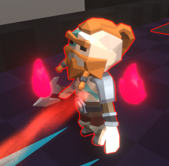
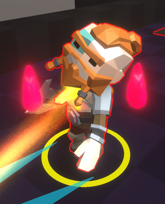
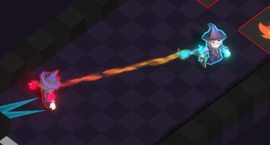
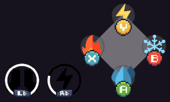
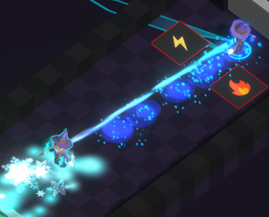

In Twin Soul the game feel is essential.
This is one of those games where giving clear visual feedbacks to both players is to be a focus point.
Unfortunately, feedback is usually very time consuming to create and is most of the time a game's finishing touch.

This is why this part is situated in the **Pre production** section, since the prototype have to include a decent amount of feedback.
So the feedbacks given in the prototype also needs to be seen as prototyped feedback if that makes sense. 

⚠️ This part is to be tweaked/changed after iterating playtest sessions.   Please refer to the [Play testing section](<../../playtesting/index.md>)

### 🔥 Emitting elements

Players need to understand very quickly if an entity is emitting an element and if this entity is capable of casting a spell.
In the prototype level, if an entity can be interacted with by the used of an element, it gets usually outlined.

An entity capable of casting a spell (Twin and enemies) needs a bigger visual feedback, 
players need to understand what an entity is emitting just by laying their eyes on it.  
That is why we are making 3D representation of the element turning around the entity constantly while giving them an outline.

Entities can also be boosted by an element, in case of a boost we add a circle effect at the entity's feet.
This feedback is somewhat lacking, as the testers had a hard time understanding this feedback.
At the time, no solutions were found.

### ⛓️ Link

The link is represented as suggested in the [Link concept sketching](<../main-mechanic/Link-concept.md>).  
The elements travelling through the link are well identified by the testers.

### ⏸️ UI

Not much attention was given to the UI of the prototype. 
The UI needed to be very explicit, to let players know when their abilities can be used and not.
The testers liked them, since it is very simple.

> UI when the player is repressed. Player cannot use its abilities, and the attack ability is on cooldown.

### 🌟 FX

The FX are used everywhere (Shooting projectiles, projectiles colliding, movement abilities...).
Those are one of the main reason Twin Soul has fun-to-use movements. 
Testers are always dashing everywhere and whenever possible !

> Players casting their movement abilities
