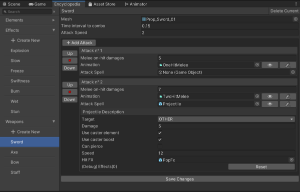
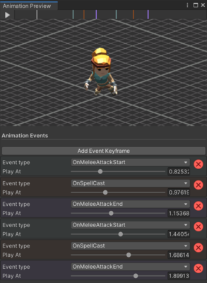

💡 As a reminder, the source code of the prototype can be retrieved here: 
[**Github repository**](https://github.com/Mathieu-Schmerber/TwinSouls_prototype)

## ⚙️ Engine

Twin Souls is developed under **Unity Engine**.  
This is a perfect fit of an engine, since Twin Souls does not need very detailed graphics 
(even if Unity can provide high quality graphics, a lot of time is required to set everything up).  

**Unity Engine** provides extensible editor tools which is essential for the development of a game like 
**Twin Souls** where a lot of values always need to be tweaked.

## 🔨 Tools

Speaking of tools, let's describe what is in place:

* :bricks: ProBuilder (Unity package)
> Probuilder is a built-in Unity package, used to create or edit any 3D Mesh from within the editor.
> ProBuilder will be used to design Twin Soul's prototype when it comes to level design or even simple props.

* :mag: Odin Inspector (External asset)
> Odin Inspector is a paid asset from the Unity Asset Store.
> Odin Inspector will provide a Unity Editor framework extension, which will make the editor tools development much quicker.

* :woman_running: Mixamo (External website)
> Mixamo is a web site providing 3D character animations and auto rigging.
> Mixamo is used to animate every character in the game.  
> [Mixamo Website](https://www.mixamo.com/#/)

* :package: Scriptable objects (Own tools)
> Twin Souls makes use of a lot of scriptable objects to store its data, most scriptable objects also have their own editor tool.

* :books: Encyclopedia (Own tools)
> Encyclopedia is an editor tool I (Mathieu Schmerber) developed for Twin Souls.
> The Encyclopedia stores Twin Soul's main resources, it acts as the game dashboard when it comes to adding new content or tweaking values.

> Encyclopedia tool overview

> Encyclopedia attack animations management tool