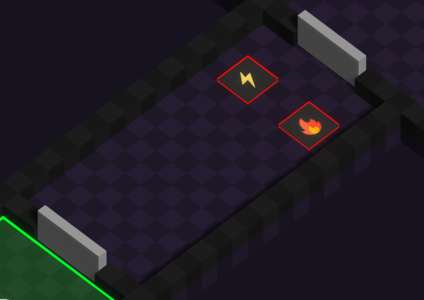

This area must be the simplest one.  
The main objective for this area is to give a bit of space to the players to maybe move around and discover the controls.

Through this area, players should discover the mechanics of voting and switching of elements.  
For those principles to be understood, 2 pressures plates will be facing a door.

The pressure plates will be of element 🔥 and ⚡️ which are complementary.  
This way we can avoid players going through repressions to much ([🔍️ Fusion & Repression](<../gameplay/main-mechanic/Fusion-Repression.md>)).

**Edit: In game area**

