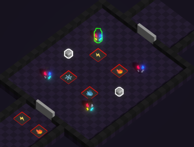

This area is meant for players to understand the fusion mechanic and start cooperating ([🔍️ Fusion & Repression](<../gameplay/main-mechanic/Fusion-Repression.md>)).

To achieve this effect, it will first make use of 4 pressure plates representing the 4 elements, and 2 boxes (without timer).
This will be a simple setup to make players understand what the boxes are.

For the players to understand the fusion and boost system, 4 pillars will be placed as well:

* A pillar needing 💧  
Timer: 1 second
* A pillar needing ⚡️  
Timer: 1 second
* A pillar needing ❄️ and 💧 (Easy fusion)  
Timer: 1 second
* A pillar needing ⚡️ and 💧 (Repression possible if not quick)  
Timer: 5 seconds

No pillars needing 🔥 will be present, as we want to avoid players dying by the repression of 🔥 burn effect.

**Edit after playtesting:** The 💧 pillar has been replaced by a fully activated pillar. 
Please refer to [Playtest session #1](<../playtesting/discovery-session1.md>) for details.

**Expected solution**

1. Conveting the boxes to two different element, and placing them on the associated pressure plates.
2. Using the same element to trigger the ⚡️ pillar
3. Creating a fusion with ❄️ and 💧 to trigger the corresponding pillar
4. Switch to both ⚡️ and hitting the last pillar
5. Switch to both 💧 and hitting the last pillar, in order to avoir repression
6. Switching elements to fit with the remaining 2 pressure plates

**Edit: In game area**

