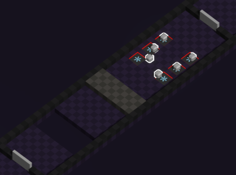

This area will focus on making the players discover their movement abilities.

* First, players will face a pit. If players fall in the pit, they will die, they will have to dash above it.
* Then they will be facing a wall that they will have to flash.
* Lastly 6 ❄️ pressure plates will be placed along side 6 timed boxes. Triggering the pressure plates will open the door.

This should be enough to make the players understand in what way movement abilities change with their element.

**Expected solution**

1. Dash over the pit with either 🔥, ⚡️ or 💧 movement ability
2. Flash over the wall with the ⚡️ movement ability
3. Place the boxes on the pressure plates
4. Convert every boxes to ❄️ using the ❄️ movement ability

**Edit: In game area**

