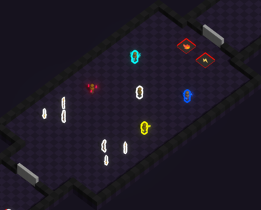

This area will not contain any puzzle, and is meant for players to figure out how the [🔍️ Fusion & Repression](<../gameplay/main-mechanic/Fusion-Repression.md>) works in combat.

For this purpose to be fulfilled, 5 training dummies will be placed; Dummies are idling entities emitting an element:

* A dummy not emitting any element (eg. repressed)
* A 💧 dummy
* A ⚡️ dummy
* A 🔥 dummy
* A ❄️ dummy

Every [⚔️ Weapons](<../gameplay/combat-mechanic/weapons.md>) will also be placed on the ground so players will be able to test each one of them.

To open the door to the next area, ⚡️ and 🔥 pressure plates will be placed.

**Edit: In game area**

