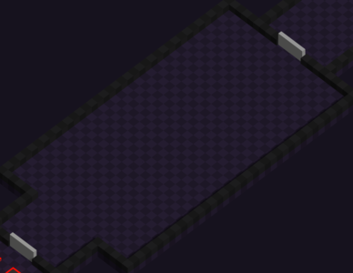

This room is meant for players to discover what fighting is like in Twin Souls.  
Given the complexity of the core mechanics, players will most likely meet their death a few times in this area.

When entering this area, monster will start spawning in 3 waves:

**1st wave**: 2 monsters 
**2nd wave**: 3 monsters 
**3rd wave**: 4 monsters

After clearing the 3 waves, the door to the next area will open marking the end of the prototype level.

### Monsters

Monsters are entities emitting a random element defined on spawn.

Monsters are running aroung the area, shooting the players.  
Monsters will not try to hit the players with melee attacks and will be given random weapons upon spawning.

Monsters define their attack power based on the weapon they are holding, like the Twins.

* 👟 Their speed is **{5.5}** units
* ❤️ Their health is **{20}** hp

⚠️ Values are to be set/changed after iterating playtest sessions.   Please refer to the [Play testing section](<../playtesting/index.md>)

**Edit: In game area**

