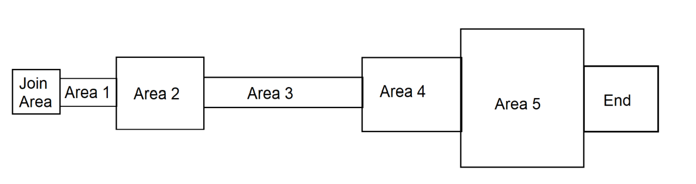
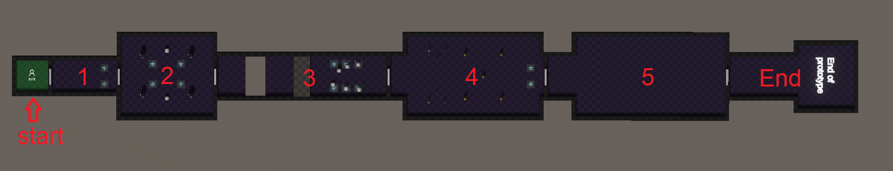

This section will be focusing on the prototype level.

### Goal

This level will need to have enough content to make future play testers understand what is possible for Twin Souls.
The goal is not to provide a fun experience with a complexe and interesting level, 
it is solely to show the opportunities Twin Souls could offer if the scale was wider.

This level will need to summarize the different steps we could encounter in Twin Souls' stages, like puzzle solving and fighting.

As mentioned in the [Home Section](<../index.md>), Twin Souls have a complex mechanic that will need to be slowly introduced over a few stages.
This prototyped level will need to make the play testers understand the very basic of the mechanics.

**An explanation of the mechanic will still be given to the testers beforehand, as summarizing the mechanic in a short prototype will be impossible.**

### Level

The level will be coomposed of **5 different areas** each showing a mechanic to the testers.
Each area is documented in the next sections.

Each area will be closed by doors. The doors to the next area will need to be opened by resolving the current area.

**Quick map sketching**

> Rough scale per area, above view

**Edit after level designing**

> Current in game map, from above