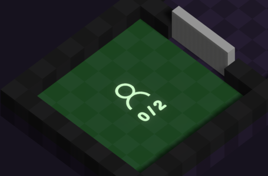

The join area is the smallest area.

Players will spawn in it after pressing their controller or keyboard inputs:

* A - On Xbox controllers
* X - On PS4 controllers
* Space bar - On Keyboards

When two players are in the area, the door to the next area opens.

Payers will spawn with an Axe ([⚔️ Weapons](<../gameplay/combat-mechanic/weapons.md>)) and emitting the 🔥 element.

**Edit: In game area**

