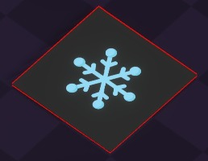
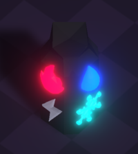
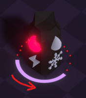
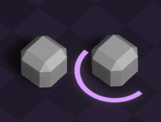

Since Twin Souls will contain puzzle stages, 
it is necessary to implement a few puzzle elements to be used in the prototype.
Of course, most puzzle elements would need to be interacted with by using specific elements in order to complement the main mechanics.

### 🚪 Door

A door will just be a simple door.  
To open it, an list of activatables will need to be triggered.

## 🚨 Activatables

### 🔲 Pressure plate

The pressure plate is as simple and basic as it sound, players just need to stand on it.

To make it more interesting let's make the pressure plate activatable by ANY entities standing on it.
Also the pressure plate can only be activated by emitting a specific element when standing on it.
This way, it will be possible to have interesting level designs, we could imagine a level where players 
need to bait a monster into walking on a pressure plate of its element.

**Prototype design**

> Pressure plate needing an entity emitting ❄️ element to stand on

### ⌛️ Elemental pillar

The elemental pillar will be an entity acting as a switch.
By design, it will look like a pillar with incrusted gemstones taking the form of the elements from the [🎡 Elements equality wheel](<../gameplay/main-mechanic/Elements-equality-wheel.md>).
To be activated, it will require to have its 4 gemstones to be lighten up.  

To light up a gemstone, player needs to cast a spell on the pillar of the same element as what the gemstone represents.
To make it interesting, when the pillar gets hit with an element already activated, it should switch of the corresponding gemstone.
This way, players would need to manage their elements and boosts through the link, as they could turn on and turn off gemstones if they are not cautious enough.

To avoid the setup to be to easily solved, a solution needs to be found to somehow limit the player actions on the pillar, while still making a puzzle enable to be solved.  
**EDIT solution found:** Whenever the pillar is hit, a short timer starts and at the end of it, the pillar should reset to its initial state. 
This way players will need to be quick enough to react and will need some time to create a little strategy in their element voting system.

**Prototype design**

> Pillar needing to be hit by the ⚡️ element and ONLY the ⚡️ element.

**New design after playtesting**

Players had a hard time figuring out what was going on whith the pillar reseting, so I've added a visual timer underneath.

> Pillar on the verge of reseting, the timer is represented by a circle disappearing reversed clockwisely.

### 📦️ Elemental box

The elemental box will be a simple entity, moveable by the players.
The box can get hit by a spell, and will absorb the spell element to then emit it.

This way the box can also trigger the pressure plates, addind a new possibilities of level designs.

**Edit after level designing the prototype**: A variant of the box has been included. 
An elemental box can have a timer (similar to the elemental pillar) which resets the box element after being hit.  
This way we can restrict the players to activate the boxes only by casting movement abilities.

**Prototype design**

> Simple box on the left, Timed box on the right